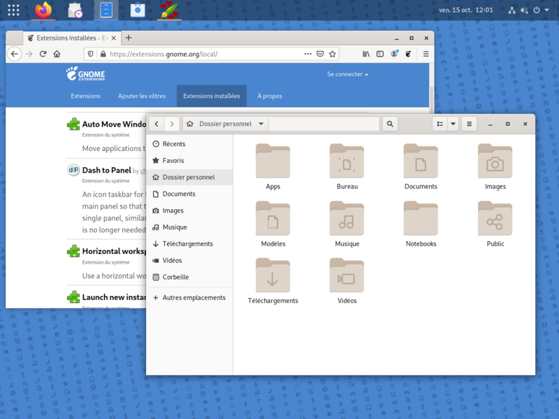

# Debian pour tous



Script d'installation d'une Debian pour tous

## Préalables :
- Créer une image iso de la Debian à partir de la version la plus stable sur une clé usb
- https://cdimage.debian.org/debian-cd/12.0.0/amd64/iso-cd/
- Debian 12 Bookworm ```debian-12.0.0-amd64-netinst.iso)``` à la date 11 juin 2023

## Installation de Debian sur la machine cible :
- Créer une clé USB avec l'iso téléchargé
- boot sur la clé USB
- choisir l'installation par défaut (Gnome)

## Installations des applications
Dans un terminal
```bash
su -
apt install git curl
# apt install spice-vdagent (si dans VM pour partager le presse-papier)
adduser <compte> sudo
# dans firefox rechercher `github pbillerot` pour copier la commande suivante
curl -sSL https://raw.githubusercontent.com/pbillerot/debian-pourtous/master/debian-mini.sh | sh
reboot
```

## Bureau Dash to panel
- dans firefox rechercher `gnome extension`et `Cliquez ici pour installer l'extension du navigateur`
- Installer `Dash to panel`
- Paramètres
  - Position / Position du panneau : Haut
  - Style / Style de l'indicateur d'activité (Application active) / Couleur de l'indicateur - Icône dominante
  - Style / Remplacer l'opacité du thème du panneau
  - Comportement (Behavior) / Dégrouper les applications / Longueur maximum (px) des titres... = 0


[Réglages](debian personnalisation.md)

